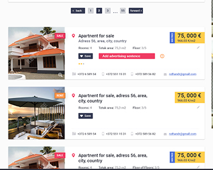

# ok-real-estate-advertisements

Учебный проект курса
[Kotlin Backend Developer](https://otus.ru/lessons/kotlin/?int_source=courses_catalog&int_term=programming).

Real estate advertisements - это площадка, на которой пользователи выставляют предложения о продаже недвижимости.
Задача площадки - предоставить набор вариантов с предложениями.

## Визуальная схема фронтенда

## Документация

1. Маркетинг
    1. [Заинтересанты](./docs/01-marketing/02-stakeholders.md)
    2. [Целевая аудитория](./docs/01-marketing/01-target-audience.md)
    3. [Конкурентный анализ](./docs/01-marketing/03-concurrency.md)
    4. [Анализ экономики](./docs/01-marketing/04-economy.md)
    5. [Пользовательские истории](./docs/01-marketing/05-user-stories.md)

2. DevOps
   1. [Схема инфраструктуры](./docs/02-devops/01-infrastruture.md)
   2. [Схема мониторинга](./docs/02-devops/02-monitoring.md)

3. Приемочные тесты - [ok-real-estate-advertisements-acceptance](ok-real-estate-advertisements-acceptance)

4. Архитектура
   1. [Компонентная схема](./docs/04-architecture/01-arch.md)
   2. [Интеграционная схема](./docs/04-architecture/02-integration.md)
   3. [Описание API](./docs/04-architecture/03-api.md)

# Структура проекта

1. Транспортные модели и мапперы
   1. [specs](specs) - спецификации openapi
   2. [ok-real-estate-advertisements-api-v1-jackson](ok-real-estate-advertisements-api-v1-jackson) Версия 1, используется jackson
   3. [ok-real-estate-advertisements-mappers-v1](ok-real-estate-advertisements-mappers-v1) Мапперы из транспортных моделей v1 во внутренние модели

2. Бизнес-логика и внутренние модели 
   1. [ok-real-estate-advertisements-common](ok-real-estate-advertisements-common) Внутренние модели, общие хелперы и интерфейсы
   2. [ok-real-estate-advertisements-stubs](ok-real-estate-advertisements-stubs) Стабы

3. Приложения (точки входа)
   1. [ok-real-estate-advertisements-app-common](ok-real-estate-advertisements-app-common) Общий код для приложений
   2. [ok-real-estate-advertisements-app-spring](ok-real-estate-advertisements-app-spring) Spring
   3. [ok-real-estate-advertisements-app-kafka](ok-real-estate-advertisements-app-kafka) Kafka

## Подпроекты для занятий по языку Kotlin

1. [m1l1-hello](m1l1-hello) - Вводное занятие, создание первой программы на Kotlin
2. [m1l3-oop](m1l3-oop) - Объектно-ориентированное программирование
3. [m1l4-dsl](m1l4-dsl) - Предметно ориентированные языки (DSL)